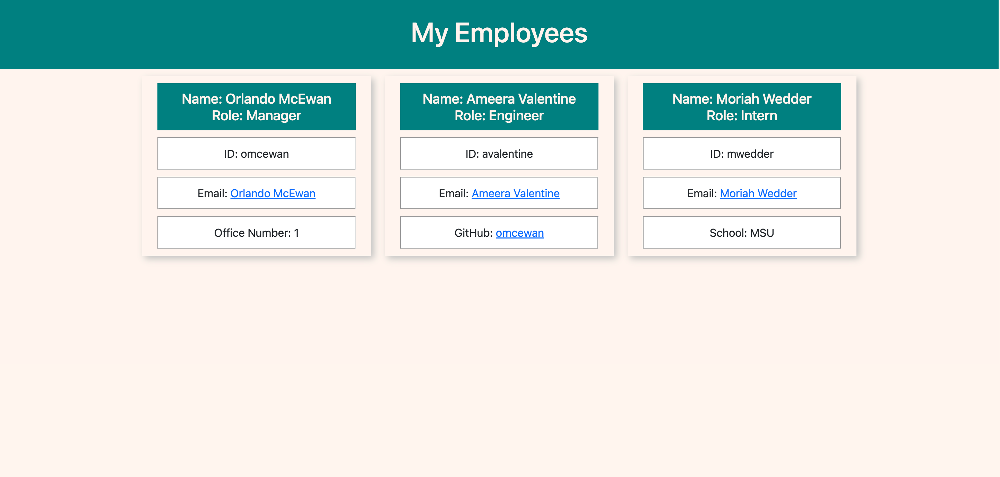

# Team Profile Generator

## Description
This application is used to generate a web application that displays the member of your team. You are prompted for basic information using inquirer and the information inputted. You can enter as many engineers and interns as you desire for your team, the application is built to display all data entered. For a more in detail description of the application please use this link, https://watch.screencastify.com/v/JWjOcCjghZfNkis8PeKo, which is a video demo of the application.

## Built With
 * JavaScript
 * HTML
 * CSS
 * Bootstrap
 * Node
 * Inquirier
 * Jest

## ScreenShot

## Installation
To install this application, you will need to have node.js installed. Once node is installed, clone the appliction to your system and run npm instal on the command line you will have successfully installed the application and can then initialize it by running node index.js.

## Tests
Jest was used to test classes functionality of this application. Test environments were set up for each class and can be found in the __test__ directory. These test can be run after the application is installed by running npm test on the command line.

## Questions
For additional information about the project, please find it at the following www.github.com/omcewan.
Also if you have additional questions please contact me at orlandomcewan231@gmail.com.
